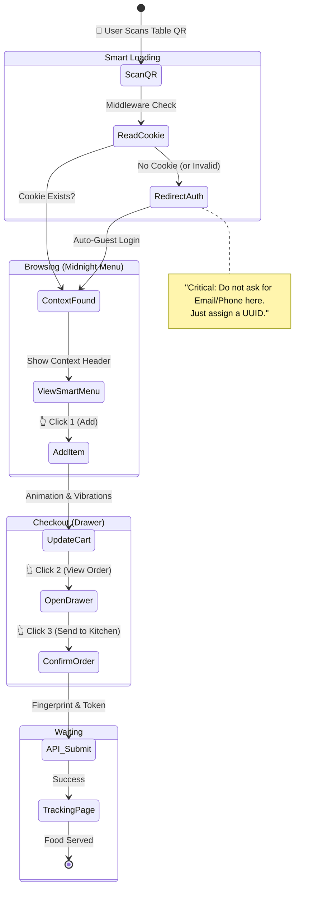

# UX-0001: Guest Journey Map (Zero-Friction)

**Owner:** Empathy
**Status:** DRAFT

## Objective
Visualize the "3-Click Flow" and ensure no barriers (like Login) exist.

## The Journey (Mermaid)

## Key Metrics (Drop-off Prevention)
1.  **Load Time**: Must be < 1.5s (PWA Cache).
2.  **Input Fields**: Target = 0 (Zero inputs required to order).
